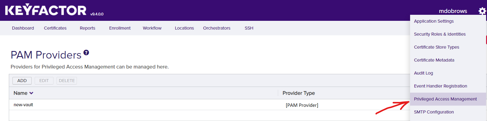
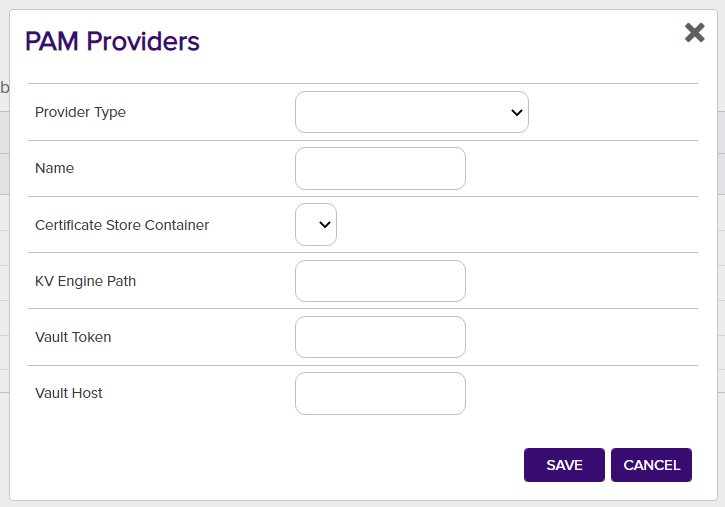
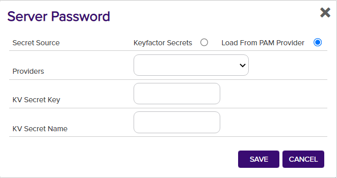

# IntegrationSandbox

Sandbox for testing workflow and scripting

#### Integration status: Prototype - Demonstration quality. Not for use in customer environments.

## About the Keyfactor PAM Provider

Keyfactor supports the retrieval of credentials from 3rd party Priviledged Access Management (PAM) solutions. Secret values can normally be stored, encrypted at rest, in the Keyfactor Platform database. A PAM Provider can allow these secrets to be stored, managed, and rotated in an external platform. This integration is usually configured on the Keyfactor Platform itself, where the platform can request the credential values when needed. In certain scenarios, a PAM Provider can instead be run on a remote location in conjunction with a Keyfactor Orchestrator to allow credential requests to originate from a location other than the Keyfactor Platform.

---


#### Compatibility
This release was tested against Hashicorp Vault version 1.9.4.

### Initial Configuration of PAM Provider
In order to allow Keyfactor to use the new IntegrationSandbox, the definition needs to be added to the application database.
This is done by running the provided [add_PAMProvider.sql](./add_PAMProvider.sql) script on the Keyfactor application database, which only needs to be done one time.

If you have a hosted environment or need assistance completing this step, please contact Keyfactor Support.

### Configuring Parameters
The following are the parameter names and a description of the values needed to configure the IntegrationSandbox.

| Initialization parameter | Display Name | Description | Instance parameter | Display Name | Description |
| :---: | :---: | --- | :---: | :---: | --- |
| Host | Vault Host | The IP address or URL of the Vault instance, including any port number | Secret | KV Secret Name | The name of the secret in the Vault |
| Token | Vault Token | The access token for the Vault | Key | KV Secret Key | The key to the key-value pair of the secret to access |
| Path | KV Engine Path | The path to secrets in the Vault. By default this would be at 'v1/secret/data' |

### Configuring for PAM Usage
#### In Hashicorp Vault
When configuring the Hashicorp Vault for use as a PAM Provider with Keyfactor, you will need to set up and configure the `kv` functionality in Vault. You will need an API Key that has the right permissions. The default `secret` location can be used, or another location.

After adding a secret object to `kv` with a key and value, you can use the object's name (the "KV Secret Name") and the secret's key (the "KV Secret Key") to retrieve credentials from the Hashicorp Vault as a PAM Provider.

#### In Keyfactor - PAM Provider
##### Installation
In order to setup a new PAM Provider in the Keyfactor Platform for the first time, you will need to run [the SQL Installation Script](./add_PAMProvider.sql) against your Keyfactor application database.

After the installation is run, the DLLs need to be installed to the correct location for the PAM Provider to function. From the release, the IntegrationSandbox.dll should be copied to the following folder locations in the Keyfactor installation. Once the DLL has been copied to these folders, edit the corresponding config file. You will need to add a new Unity entry as follows under `<container>`, next to other `<register>` tags.

When enabling a PAM provider for Orchestrators only, the first line for `WebAgentServices` is the only installation needed.

The Keyfactor service and IIS Server should be restarted after making these changes.

```xml
<register type="IPAMProvider" mapTo="Keyfactor.Extensions.Pam.Hashicorp.VaultPAM, hashicorp-vault-pam" name="Hashicorp-Vault" />
```

| Install Location | DLL Binary Folder | Config File |
| --- | --- | --- |
| WebAgentServices | WebAgentServices\bin\ | WebAgentServices\web.config |
| Service | Service\ | Service\CMSTimerService.exe.config |
| KeyfactorAPI | KeyfactorAPI\bin\ | KeyfactorAPI\web.config |
| WebConsole | WebConsole\bin\ | WebConsole\web.config |

##### Usage
In order to use the PAM Provider, the provider's configuration must be set in the Keyfactor Platform. In the settings menu (upper right cog) you can select the ___Priviledged Access Management___ option to configure your provider instance.





After it is set up, you can now use your PAM Provider when configuring certificate stores. Any field that is treated as a Keyfactor secret, such as server passwords and certificate store passwords can be retrieved from your PAM Provider instead of being entered in directly as a secret.



---


### License
[Apache](https://apache.org/licenses/LICENSE-2.0)

